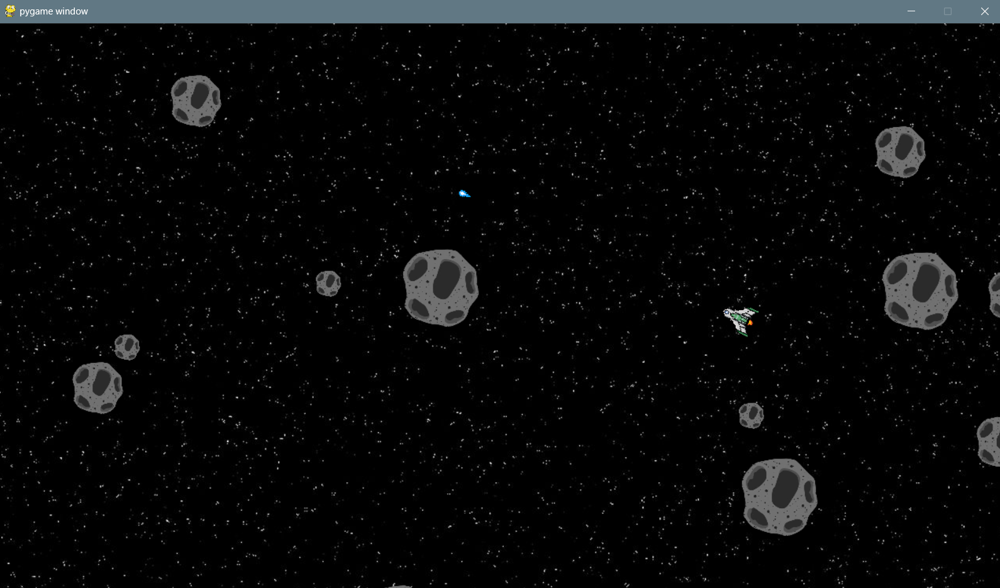

# **Asteroids**
A classic Asteroids arcade game using Pygame. Navigate through space, shoot asteroids, and try to survive as long as possible!

## **Gameplay**


## **Prerequisites**
Python 3.11 or higher

## **Installation**
1. Clone the repository:
   ```sh
   https://github.com/adityaThakkar001/asteroids.git
   cd asteroids
   ```
2. Install required packages using requirements.txt:
   ```sh
   pip install -r requirements.txt
   ```
3. Ensure you have the required assets in the `assets` folder:
   * `ship.png` - Spaceship Sprite
   * `asteroid.png` - Asteroid Sprite
   * `shot.png` - Projectile Sprite
   * `stars_space_dark_139528_1280x720.jpg` - Background Image

## **Game Controls**
- `W` - Thrust Forward
- `S` - Thrust Backward
- `A` - Rotate Left
- `D` - Rotate Right
- `SPACE` - Fire Projectile
- Close window to quit game

## **Future Enhancements**
- [ ] Score system
- [ ] Multiple lives
- [ ] Power Ups
- [ ] Sound effects
- [ ] High score tracking
